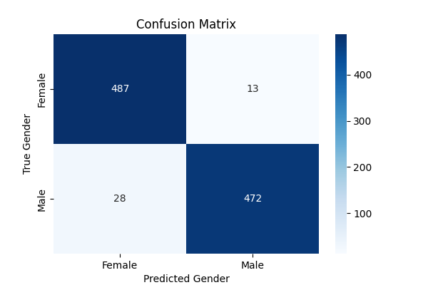
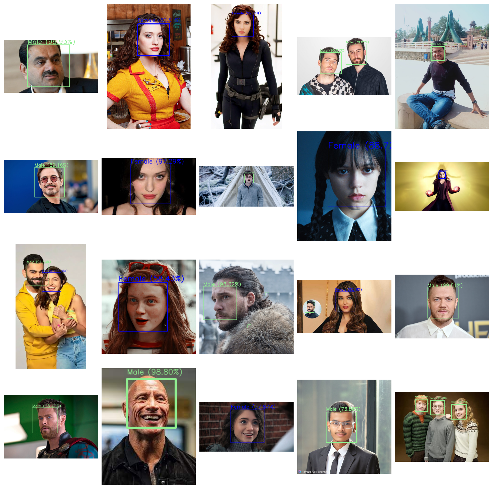

# Gender Detection Using Convolutional Neural Network

This project is part of Winter-Project organised by IIT Kanpur Consulting Group for Y24 batch. It utilizes a Convolutional Neural Network (CNN) model to detect the gender of individuals in images. It demonstrates the use of deep learning techniques for real-world applications like face recognition and gender classification.  

---

## Features
- **Real-time Webcam Detection:** Use your webcam to detect the gender of individuals live.
- **Batch Processing:** Analyze the images of your choice by putting them in `CustomImages` folder and running the perticular cells of `Detector.ipynb` as instructed in the Notebook itself.

---

## Structure of Project

#### Dataset
The data used for training testing and validation for this model is included within this repository. The training data contains total 8000 images equally divided to both the classes. The Validation and Test data contain 500 and 1000 image respectively, equally divided in both the class.

#### Model Building
Then I used `sequencial` model from `tensorflow.keras.models` and I included total 5 convulation layers with 1 fully connected layer followed by the output neuron(Further details are presented in the respective Jupyter Notebook). After being trained the model was saved as `gender_detection.model` (since the gender_detector.model was way too large to uploaded over github, here's the [Google Drive link](https://drive.google.com/drive/folders/1xc4z3f9a65MNeXqZ4RrncNs4X8l6PUw0?usp=drive_link) for accessing that) to avoid retraining and to be directly use in the `detector.ipynb`. Then the model was evaluated over test data and the results are in the next section of this README file.

#### Detection
In the detection part for detecting gender in images I used `openCV` to detect and cropout all the faces from the images present in the `CustomImages` folder to be passed into the model for detection. Anyone can put their image and run the program to test over their their own set of images.  
Then for the live detection I used `VideoCapture` from openCV and for face detection form frames of the video I used `cvlib`. Then I went with passing them to my model and constantly detecting and updating the frames.

##### I tried to make the jupyter notebooks well commented and well explained through markdown language.

---

## Accuracy of Model
So far I achieved an accuracy of `94.499%` over the test data of 2000 images which resulted in the following confusion matrix:  

---

## Example Images
Here are some sample outputs from the project:  
  
Although you may notice that Hermoine in the last image is classified as male, but there are total 25 faces in those 20 images so getting one wrong makes accuracy of 96% which still according to my accuracy over training set of 94.5% :)

## Real-Time Webcam Detection
Here's a demo of live detection via webcam just **click on the below image** to check out the demo over Youtube.  
  
The demo-video is also included in this repository.

---

## User Instructions

If someone else wants to try this model. Follow the following steps
- Clone the repository
- Download `gender_detection.model` folder from [here](https://drive.google.com/drive/folders/1xc4z3f9a65MNeXqZ4RrncNs4X8l6PUw0?usp=drive_link) and paste it in the clone of repository. Or you can directly run the `Training.ipynb` to train and save the model.
- If you have an image to test on, just paste it in the CustomImages folder and Run the cell 1, 2 and 3 of Detector notebook.
- If you want to use the webcam, just run the cell 1, 2 and 4 from Detector Notebook.

## Made by-
**Vishesh Kumar Singh**
- [LinkedIn Profile](https://linkedin.com/in/thevishesh16)
- [GitHub Profile](https://github.com/vishesh-kumar-singh)

