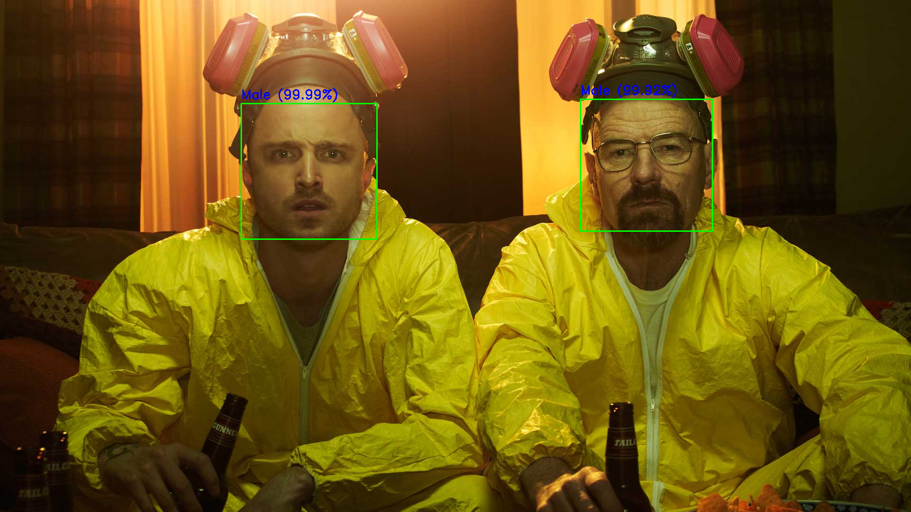
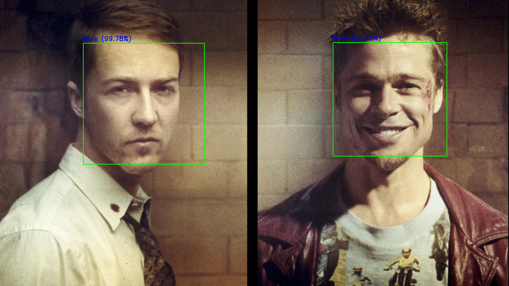
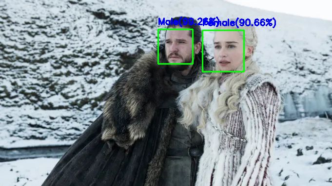
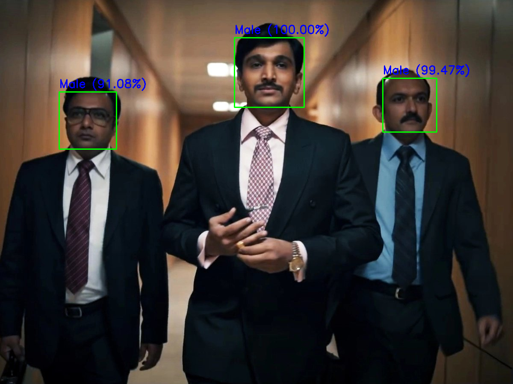
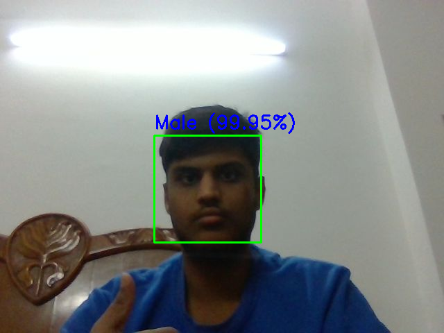

# Gender Detection Model using CNN

This is a part of 'Pixel Persona' which is the winter project organized by ICG club of IIT Kanpur. 
It is a gender detection model which uses a convolutional neural network to predict the gender of a given face. It also uses the Haar Cascade model to detect faces in a given image.

## Features

- Detect multiple faces in an image and predict the gender
- It can use the webcam to predict the gender in real time

## Accuracy

- The test accuracy is 89.66%
- The overall accuracy over various other images was 86.84%

## Example Images
 Here are some examples of face detection and gender classification-

Here is an example showcasing the webcam feature:

